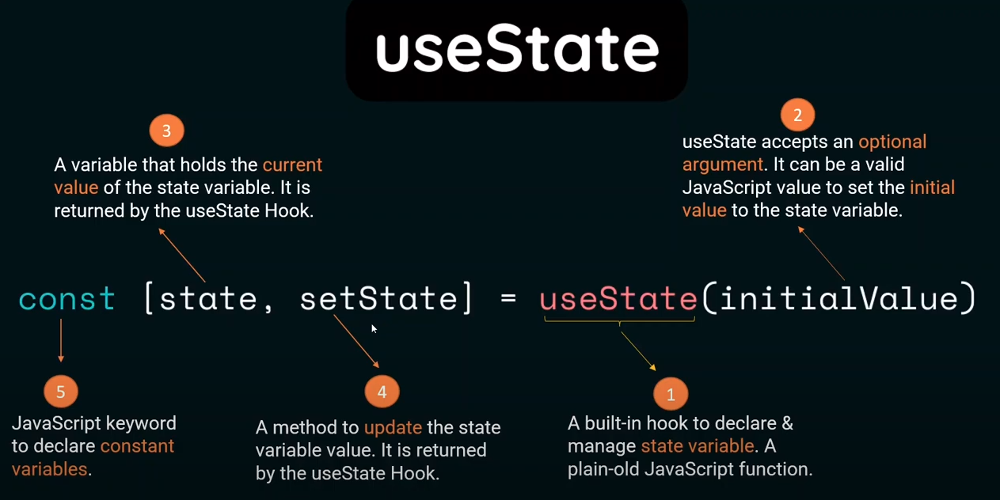
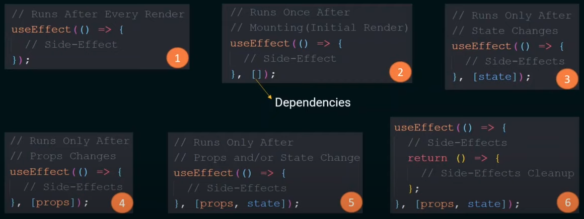

# React Understanding

## Components:
- **Component** is plain old JavaScript **Function**
- The Function must return **something**
- The **something** is the **JSX**
- **`State`**: The Component may have data private to itself. We call it **State**.
- **`Props`**: The Component may have data to share with other Components. We call them **Props**.

## React Hooks:
- **React Hooks** are simple JavaScript functions that we can use to separate out the **reusable** part from a functional components.
- It can be **stateful** and can manage **side effects**!!!
- **`Basic Hooks`**: useState, useEffect, useContext
- **`Additional Hooks`**: useRef, useMemo, useReducer, useCallback, useDebugValue, useLayoutEffect, useImperativeHandle

### **useState**:

### **useEffect**:
`useEffect` is a React Hook that lets us synchronize a component with an external system.

    useEffect(setup, dependencies?)
    
#### 6 Primary usages of **useEffect**:
